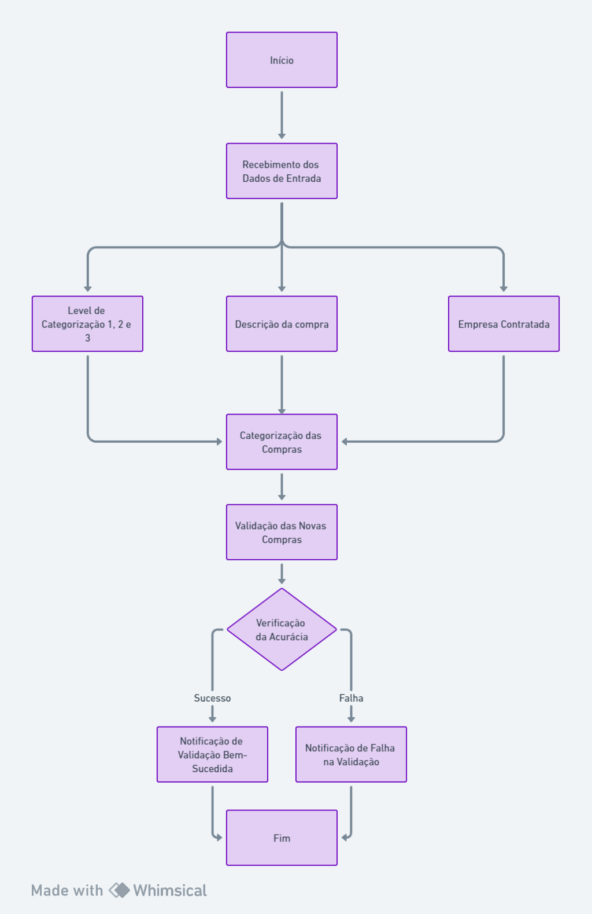
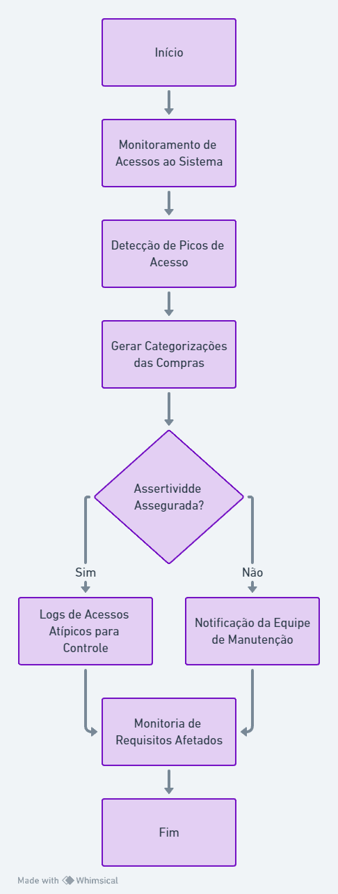
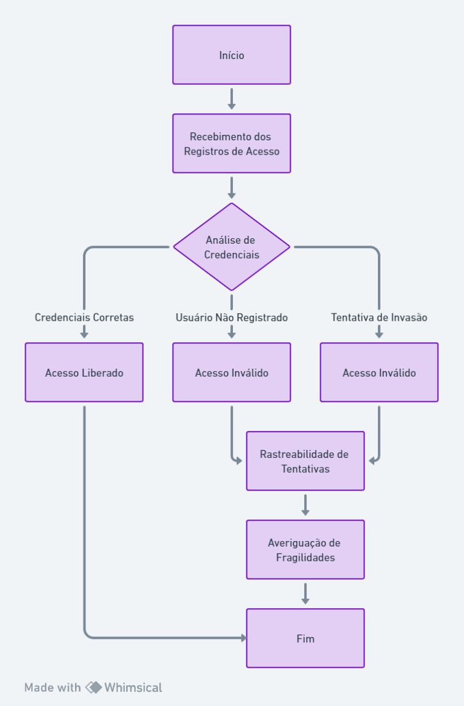
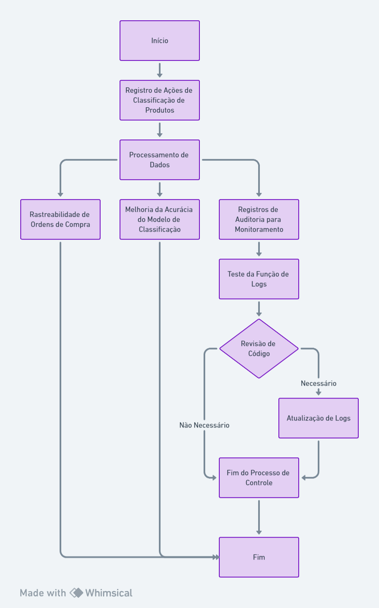
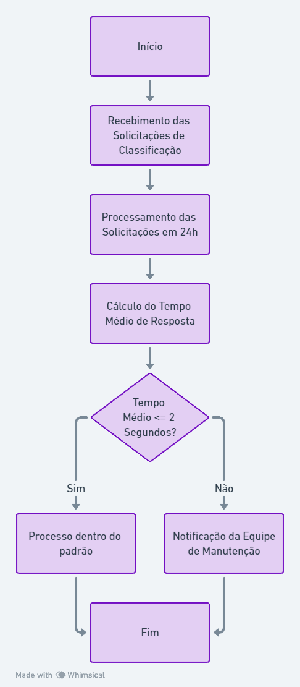

## Arquitetura do Sistema Novo - Mapa de requisitos não funcionais e respectivas vulnerabilidades (Sprint 2)

### RNF1: Aumentar a assertividade na classificação dos itens de compras a mais de 95%

No sistema atual, temos uma assertividade de 65%. Com o objetivo de elevar essa assertividade para 95%, utilizaremos os dados textuais dos Pedidos de Compra (POs) para, por meio de processamento de linguagem natural e modelos preditivos, atingir o nível desejado.

Os dados de entrada são as informações descritivas das POs, como: Descrição da compra, level de categorização 1, 2 e 3, e empresa contratada. A saída é a categorização das respectivas compras. A estratégia de controle consiste em um teste periódico da base para verificar a acurácia. A cada 24 horas, as novas compras categorizadas serão validadas com base no histórico das categorizações anteriores, notificando o sistema caso haja falhas na validação.

  

### RNF2: Garantir que o sistema continue funcionando de forma estável mesmo em situações de alta carga

Com a finalidade de melhorar a estabilidade do sistema, será criada uma verificação para que quando uma quantidade atípica de acessos ocorrer no sistema, seja medida a acurácia no sistema. Caso ocorra alguma divergência com o requisito de assertividade, o sistema continue funcionando para não prejudicar os operadores do sistema, contudo gerando logs e informações para a equipe de manutenção.

Os dados de entrada são os acessos ao sistema e as categorizações geradas das compras durante os picos de acessos. Os dados de saída são, em caso de assertividade  assegurada, os logs de acessos atípicos para controle e monitoria, caso afete algum outro requisito, os dados de saída são, além dos logs, a notificação da equipe de manutenção. A abordagem de controle é justamente a manutenção da equipe a partir dos logs gerados, e monitoria para acompanhamento dos picos de acessos.

  

### RNF3: Ampliar o foco em privacidade e integridade de dados, focando aspectos de compliance e accountability. Incluir aspectos de resistência a acessos indevidos interno e externo, detecção e recuperação de acessos inconsistentes de segurança

Segurança de dados, ainda mais no contexto da empresa que estamos trabalhando, é essencial para sustentabilidade do negócio. Os dados que o sistema opera, como quantidade de compras e empresas que prestam serviços, podem dizer muito sobre a estratégia da empresa, evidenciando assim a necessidade desse requisito.

Os dados de entrada são os registros de acesso, por meio de tentativa de simular usuários ou invasões. Os dados de saída são o acesso liberado, caso as credenciais estejam corretas, e acesso inválido caso haja identificação de usuário não registrado ou tentativa de invasão. A abordagem de controle seria a rastreabilidade dessas tentativas, afim de averiguar possíveis fragilidades do sistema. 

  

### RNF4: Implementar registros de auditoria que rastreiem todas as ações relacionadas à classificação de produtos

No sistema atual, não temos os registros de auditoria implementados. Isso causa problemas diversos, como segurança e rastreabilidade. A entrada são os registros de todas as ações relacionadas à classificação de produtos. A saída é uma rastreabilidade de todas as ordens de compra, e dados que podem ser usados para aumentar a acurácia do modelo de classificação de produtos. Além disso, os registros de auditoria podem ser usados para monitorar o uso do sistema e investigar atividades suspeitas. A abordagem de controle seria um teste realizado na função que realiza os "logs", e eventuais revisões de código para garantir que todos os logs necessários estão sendo realizados.

  

### RNF5: Manter um tempo de resposta médio para a classificação de produtos abaixo de 2 segundos 

O tempo ideal de resposta varia de acordo com a complexidade do sistema e suas regras de negócio. No nosso cenário, apesar de desconhecermos o tempo médio de resposta do sistema vigente, optamos por estabelecer dois segundos como critério de usabilidade. Esse parâmetro leva em conta tanto a integração de microserviços quanto as distâncias entre as solicitações, considerando a operação do sistema em múltiplos países.

Como dados de entrada, temos as solicitações de classificação realizadas num intervalo de 24 horas. Já o dado de saída corresponde ao tempo médio de resposta dessas classificações nas últimas 24 horas. O método de controle envolve a verificação desse requisito, isto é, se o tempo médio exceder dois segundos, a equipe de manutenção deve ser notificada para avaliação.

  

## Melhorias Arquiteturais e Táticas para Requisitos Não Funcionais

Como parte da melhoria do sistema, devem-se ser aplicadas melhorias arquiteturais, de modo que ajudem na execução e o controle dos requisitos não funcionais. A seguir, foram especificadas as principais táticas que ajudarão em cada área.

### RNF1: Aumentar a assertividade na classificação dos itens de compras a mais de 95%

- **Monitoramento**: Implementar um dashboard de Business Intelligence (BI) que exibe em tempo real a taxa de assertividade das classificações. Se a assertividade cair abaixo de 95% em uma amostra de classificações recentes, um alerta é gerado para as equipes responsáveis averiguarem.
  
- **Resolução Preventiva/Reativa**: Utilizar um sistema de Machine Learning Operations (MLOps) para treinar continuamente o modelo com novos dados, garantindo que a assertividade seja mantida acima de 95%. Em caso de queda na assertividade, o modelo é re-treinado automaticamente com dados adicionais. Além disso, deve-se cuidar para garantir que os dados usados para treinar os modelos sejam de alta qualidade, relevantes e atualizados.

### RNF2: Garantir que o sistema continue funcionando de forma estável mesmo em situações de alta carga

- **Monitoramento**: Utilizar ferramentas de monitoramento de desempenho para acompanhar a estabilidade do sistema e alertar sobre picos de carga.
  
- **Resolução Preventiva/Reativa**: Implementar auto-scaling na infraestrutura de cloud para ajustar automaticamente o número de instâncias do servidor conforme a demanda.
  
- **Recuperação/Subsídio**: Em caso de falha de serviço, um sistema de failover é acionado para redirecionar o tráfego para servidores de reserva até que o sistema principal seja restaurado.

### RNF3: Ampliar o foco em privacidade e integridade de dados

- **Monitoramento**: Configurar o SIEM (Security Information and Event Management) para monitorar acessos e atividades suspeitas em tempo real.
  
- **Resolução Preventiva/Reativa**: Utilizar um sistema de prevenção de intrusões (IPS) para bloquear automaticamente tentativas de acesso indevido.
  
- **Recuperação/Subsídio**: Em caso de violação de segurança, ativar o plano de resposta a incidentes para investigar e remediar a questão.

### RNF4: Implementar registros de auditoria que rastreiem todas as ações relacionadas à classificação de produtos

- **Monitoramento**: Configurar alertas para qualquer atividade anômala nos registros de auditoria, utilizando principalmente dos registros dos logs do sistema.
  
- **Resolução Preventiva/Reativa**: Realizar auditorias regulares nos registros para garantir que todas as ações estejam sendo devidamente rastreadas e armazenadas, além de manter uma monitoração regular dashboard, citado no RNF1.
  
- **Recuperação/Subsídio**: Em caso de descoberta de falhas nos registros, realizar uma auditoria para entender o que ocorreu e restaurar os registros a partir de backups do sistema.

### RNF5: Manter um tempo de resposta médio para a classificação de produtos abaixo de 2 segundos

- **Monitoramento**: Implementar um sistema de Application Performance Management (APM) para monitorar o tempo de resposta das solicitações de classificação.
  
- **Resolução Preventiva/Reativa**: Para que seja garantido um tempo de resposta médio bom, será implementado um sistema de caching que armazena uma predição já feita com acurácia maior que 90%, assim caso, seja solicitada uma predição para o mesmo produto o resultado será buscado em caching e não mais será realizada uma nova predição.
  
- **Recuperação/Subsídio**: Se o tempo de resposta exceder 2 segundos, um sistema de fila de mensagens é utilizado para gerenciar a carga e processar as solicitações em ordem, evitando a perda de solicitações.

