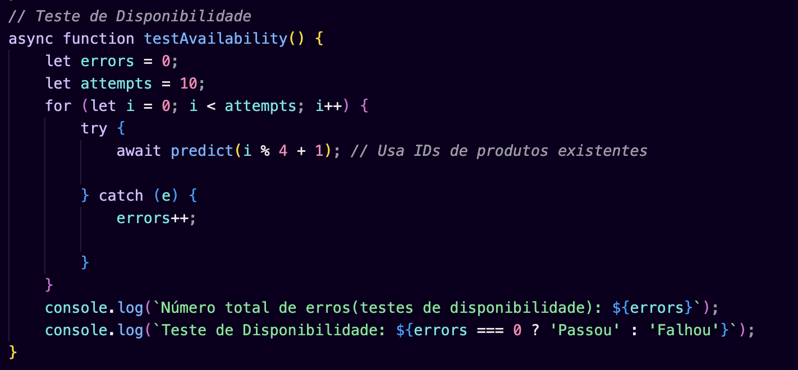
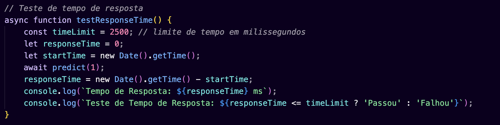
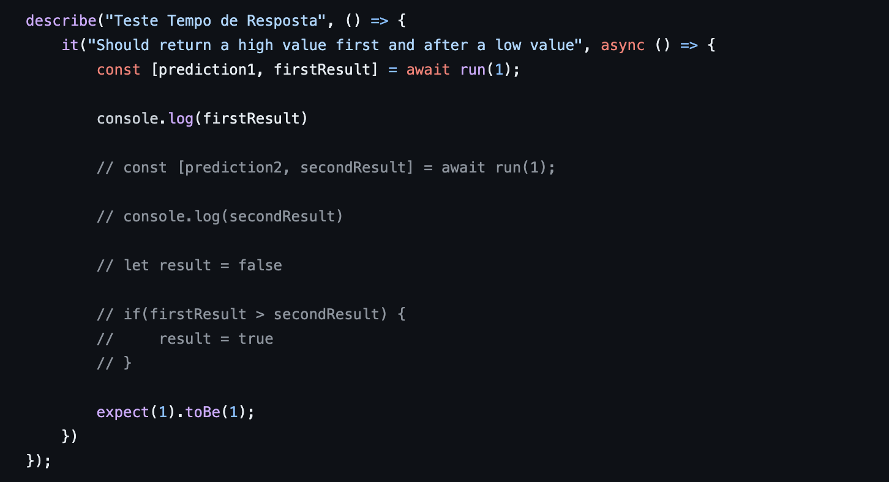
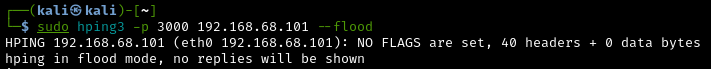
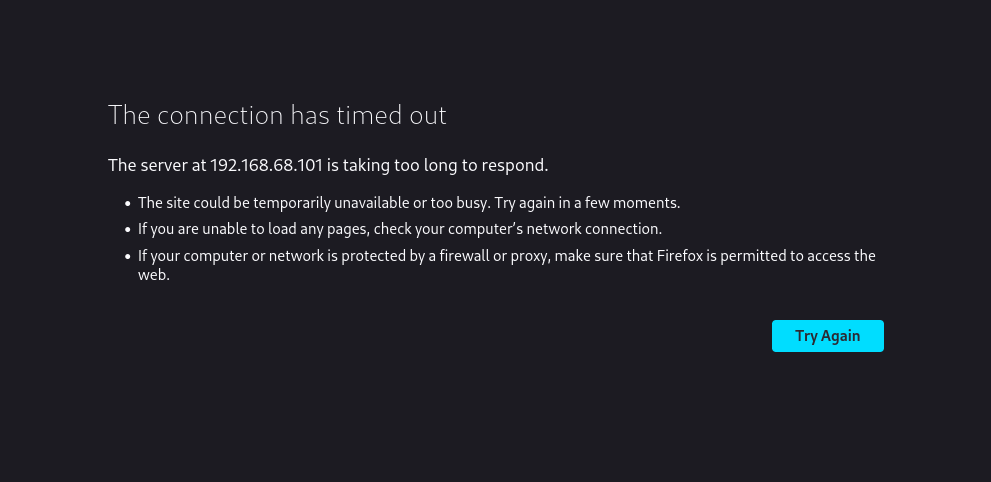

# Testes automatizados

## Mapeamento dos testes

### Disponibilidade

- **Descrição**: Os testes automatizados de disponibilidade são feitos periódicamente. De acordo com o cenário de simulação, o servidor tem 10% de chance de ficar indisponível. Os tested devem validar se esse é o resultado obtido, ou se foram resultados melhores. Se os resultados forem piores, ele deve noticar o time de desenvolvimento.

### Tempo de resposta

- **Descrição**: Os testes automatizados de tempo de resposta devem ser feitos sempre, e devem validar se o tempo de resposta está dentro do esperado, e se o cache está funcionando corretamente. Em caso de falha, deve notificar o time de desenvolvimento.

OBS: Fazer o `loop dos testes`, ou seja, fazer os testes, aprimorar e fazer de novo

# Testes automatizados, não funcionais

### 3.2.a) Mapa de Testes Automatizados

Os testes automatizados realizados nas simulações têm como foco avaliar a disponibilidade e o tempo de resposta, RNFs esses que refletem diretamente na qualidade da solução.

#### Sistema atual

No sistema atual, foram realizados dois tipos de testes, os de disponibilidade e o tempo de resposta.

O teste de disponibilidade visa assegurar que a função predict esteja sempre acessível para o processamento de solicitações. Para isso, realiza-se dez chamadas sequenciais à função, utilizando IDs de produtos válidos. O intuito é verificar se a função responde consistentemente a todas as chamadas sem erros. O resultado esperado é uma completa ausência de erros, indicando que a função está sempre disponível e não apresenta falhas de acessibilidade em várias tentativas consecutivas.

  

Já o teste de tempo de resposta foca em garantir que a função predict opere dentro de um limite de tempo aceitável. Neste caso, o tempo de resposta não deve exceder 2500 milissegundos. O teste consiste em medir o tempo que a função leva para responder a uma solicitação de predição e compará-lo com o limite estabelecido. Um tempo de resposta dentro do limite é crucial para a eficiência do sistema, especialmente em um ambiente de produção onde a rapidez na resposta pode ser crítica.

  

A abordagem de automação desses testes é realizada por meio de scripts em JavaScript, que executam as chamadas à função predict de maneira programada, registrando automaticamente os resultados. Isso assegura a execução consistente e repetitiva dos testes, permitindo uma avaliação fiável do desempenho da função.

#### Sistema novo

O esquema de teste da simulação do sistema novo introduz uma abordagem aprimorada para testar a disponibilidade e o tempo de resposta de um sistema que utiliza cadeias de Markov para simular o comportamento de máquinas em diferentes estados. Além disso, inclui um teste para avaliar o tempo de resposta de previsão de categorias de produtos.

Teste de Disponibilidade utilizando da cadeia de Markov: Este teste utiliza o método simulateMarkovChain para simular o comportamento de duas máquinas ao longo de vários passos, usando cadeias de Markov. A matriz de transição define as probabilidades de transição entre diferentes estados para cada máquina.
Ele tem como objetivo avaliar a estabilidade e o comportamento das máquinas ao longo do tempo, com foco em entender a probabilidade de cada máquina estar em um estado de funcionamento ou recuperação.
Cenários de Teste: O teste é realizado para diferentes números de passos (10, 20, 30, 40), analisando como as máquinas transitam entre os estados ao longo desses passos. Espera-se que a simulação retorne uma sequência de estados para cada máquina, correspondente ao número de passos mais um, validando a lógica da cadeia de Markov.

  

Já no teste de tempo de resposta, ele visa medir o tempo de resposta para uma previsão de categorias de produtos, de modo a avaliar o desempenho e a eficiência do sistema em termos de tempo de resposta para uma tarefa de previsão.
Cenário de Teste: O teste executa a função de previsão e registra o tempo de resposta. Inicialmente, está configurado para medir o tempo de resposta para um único caso.
Resultados Esperados: O teste busca determinar se o tempo de resposta está dentro de um limite aceitável, embora atualmente esteja configurado para simplesmente validar a execução do teste.

  

### Automação de testes

Os testes são automatizados usando o framework de teste Jest, permitindo a execução de testes assíncronos e a validação dos resultados. A automação facilita a execução repetida dos testes e garante a consistência nos resultados.

### 3.2.c) Avaliação dos Resultados e Limites do Sistema

A análise juntamente com a documentação dos testes automatizados podem ser encontradas no notebook: [new_test_notebook.ipynb](../../Simulacao/Sprint%203/tests/novo_test_documentation.ipynb)

#### Cenário de disponibilidade:

Previamente no sistema atual, possuíamos uma falha, sendo ela responsável por comprometer totalmente o funcionamento do sistema.

Onde era possível observar por meio dos testes que a disponibilidade era totalmente comprometida quando atacada:

Acima, temos a visão do atacante, que quer derrubar a disponibilidade da aplicação.

Podemos ver que a API não dá nenhuma resposta, pois ela está sofrendo um ataque de negação de serviço, e não existe nenhuma forma de limitar as requisições que são feitas nela.

Sendo assim, aplicamos as melhorias onde foram identificados gargalos na aplicação e conseguimos implementar benefícios significativos no requisito não funcional de disponibilidade:

Acima, temos a visão do atacante, que quer derrubar a disponibilidade da aplicação. 

Podemos ver que a API demonstra estabilidade, e retorna uma mensagem para o usuário que está fazendo as requisições, mostrando que ele excedeu o limite de requisições.

Portanto, conseguimos aplicar uma melhoria significativa no sistema, sendo que a partir da atualidade quaisquer ataque visando "tirá-lo do ar" , será bloqueado com maestria.

#### Cenário de Performance (Tempo de resposta):

### 3.2.d) Avaliação dos Riscos Resultantes
Riscos Identificados Previamente:

Baixa assertividade na classificação da taxonomia:

Causa: Ineficiência no algoritmo de classificação.
Impacto: Pouca otimização de custos e baixa eficiência operacional.

Gestão de compras ineficiente:

Causa: Continuação do problema de classificação.
Impacto: Aumento de custos operacionais e ineficiências na gestão de compras.

Não Atender aos Requisitos do SLA:

Causa: Falta de conformidade com padrões de disponibilidade, desempenho, rastreabilidade e tolerância a falhas.
Impacto: Impacto na confiabilidade do sistema e na satisfação durante a utilização do sistema.

Falhas de Segurança e Privacidade dos Dados:

Causa: Vulnerabilidades na segurança e privacidade.
Impacto: Comprometimento da confidencialidade, integridade e disponibilidade dos dados.

Arquitetura não disponível de forma global:

Causa: Limitações de infraestrutura ou conformidade.
Impacto: Alcance do sistema.

Avaliação Preliminar do Controle dos Riscos Apontados:

Controles viabilizados:

Melhoria no Algoritmo de Classificação:

Ação: Implementar técnicas avançadas de Machine Learning.
Objetivo: Aumentar a precisão na classificação das categorias de compra.

Monitoramento e Análise de Dados de Compras:

Ação: Estabelecer dashboards de BI para monitoramento contínuo.
Objetivo: Identificar padrões e ineficiências para ajustes rápidos.

Fortalecimento do SLA:

Ação: Implementar redundâncias, monitoramento constante e melhorias de desempenho.
Objetivo: Garantir alta disponibilidade e desempenho do sistema.

Refinamento da Segurança e Privacidade dos Dados:

Ação: Adoção de melhores práticas de segurança, como criptografia, e auditorias regulares.
Objetivo: Proteger dados contra acessos não autorizados e vazamentos.

Expansão e Adaptação da Arquitetura:

Ação: Adotar uma arquitetura escalável e compatível com diferentes regiões.
Objetivo: Garantir a acessibilidade do serviço em todas as regiões de operação da Meta.
