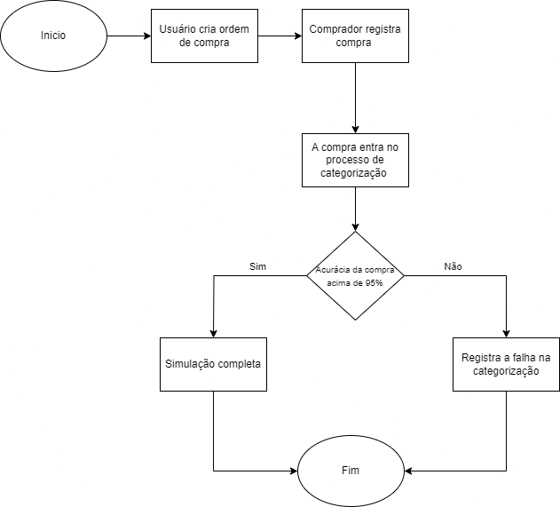
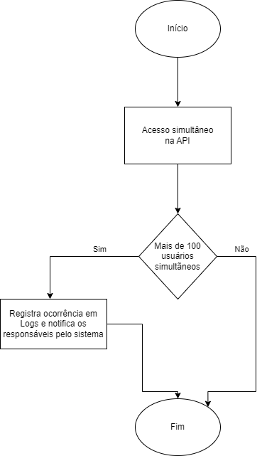
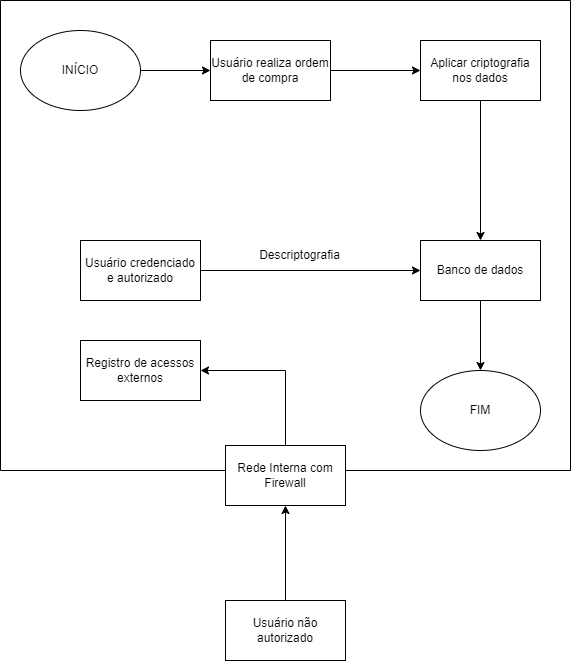
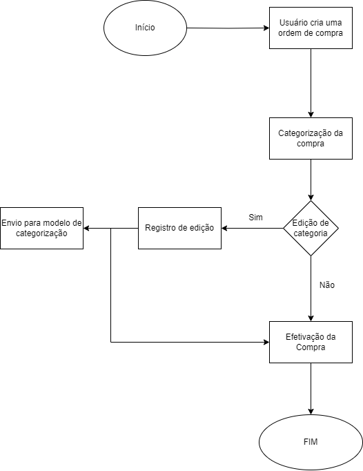

# 1. Estrutura estática do modelo (casos de simulação)

## RFN1: Aumentar a assertividade na classificação dos itens de compras a mais de 95%
Para simular como iremos melhorar a assertividade do sistema, iremos utilizar a base de dados que nos foi ofertada, e com base nas colunas de categorias, iremos simular um sistema que acerta a categoria de uma nova compra com mais de 95% de assertividade, a simulação será feita utilizando javascript e servirá de exemplo para expor a diferença entre a quantidade de gastos que podem ser categorizadas com 65% de assertividade do sistema atual, e com 95% que será proposto no sistema novo. 
A primeira versão dessa simulação pode ser encontrada no item 4 desse documento.

## RNF2: Garantir que o sistema continue funcionando de forma estável mesmo em situações de alta carga
O sistema deve assegurar a continuidade do serviço mesmo sob condições de elevada demanda e estresse. Caso o sistema falhe em satisfazer uma determinada exigência, que pode estar relacionada à precisão, segurança ou capacidade de rastreamento. Mesmo nessas circunstâncias, o sistema permanecerá em funcionamento, contudo, serão criados registros de logs para que o time de desenvolvimento possa intervir e resolver a questão.

Para avaliar o desempenho do sistema sob estas condições, iremos criar uma API destinada a realizar testes de alta carga. Quando um determinado nível de estresse for atingido, o sistema  produzirá logs e notificará os desenvolvedores responsáveis, permitindo assim que a equipe faça uma avaliação completa da integridade do sistema.

  

## RNF3: Ampliar o foco em privacidade e integridade de dados, focando aspectos de compliance e accountability. Incluir aspectos de resistência a acessos indevidos interno e externo, detecção e recuperação de acessos inconsistentes de segurança

Ao simular o foco em privacidade e integridade, é necessário realizar o processo de criptografia nos dados utilizados, de modo que atacantes externos não possam acessar esses dados, e que eles fiquem apenas acessíveis para os usuários internos. Além disso, é necessário implementar uma forma de rastrear tentativas de acessos externos à rede da Meta. 

Com a finalidade de simular a situação acima mencionada, iremos desenvolver uma api para acessar registros de um banco de dados, com acesso liberado somente para usuários credenciados, iremos simular tentativas de acessos, e registrar essas tentativas.

  

## RNF4: Implementar registros de auditoria que rastreiem todas as ações relacionadas à classificação de produtos

Iremos simular o fluxo de operação da requisição de compra até a efetivação da ordem de compra. Entretanto, o nosso sistema quando ocorrer uma alteração na ordem de compra(PO) original, essas alterações serão registradas. Isso significa que, se a categoria da ordem de compra for alterada pelo comprador, iremos registrar para fins de melhorar o sistema de categorização. 

Para realizar essa simulação desenvolveremos APIs para registrar ordem de compra e para efetuar a compra do produto. Assim, quando o comprador realizar alterações da ordem original na efetivação do pedido, essas informações alteradas serão registradas no banco de dados.

  

